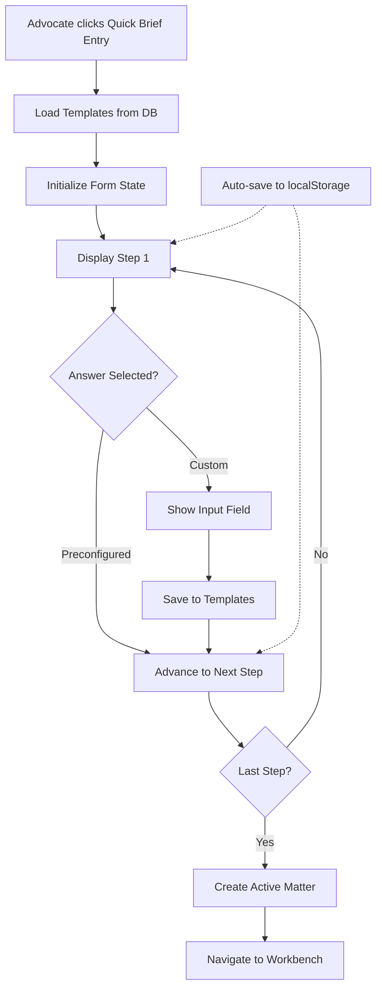

# Design Document

## Overview

The Quick Brief Capture feature transforms the existing QuickAddMatterModal into an intelligent, multi-step questionnaire system optimized for phone-based matter capture. The design focuses on speed, ease of use, and learning from advocate behavior to provide increasingly personalized experiences.

### Key Design Principles

1. **Speed First**: Every interaction should be optimized for rapid data entry while on a phone call
2. **Progressive Enhancement**: Start with sensible defaults, learn from usage patterns
3. **Mobile-First**: Design for touch interfaces with large tap targets and clear visual hierarchy
4. **Accessibility**: Full keyboard navigation and screen reader support
5. **Graceful Degradation**: Work without custom templates, provide defaults
6. **Data Persistence**: Never lose advocate's work due to accidental closure

## Architecture

### Component Hierarchy

```
QuickBriefCaptureModal (Enhanced)
├── ProgressIndicator
├── QuestionnaireStep (6 instances)
│   ├── QuestionHeader
│   ├── AnswerButtonGrid
│   │   ├── AnswerButton (multiple)
│   │   └── CustomAnswerButton
│   ├── CustomAnswerInput (conditional)
│   └── NavigationButtons
├── FirmAttorneySelector (Step 1)
├── MatterTitleInput (Step 2)
├── WorkTypeSelector (Step 3)
├── PracticeAreaSelector (Step 4)
├── UrgencyDeadlineSelector (Step 5)
└── BriefSummaryEditor (Step 6)

QuickBriefTemplatesSettings (New)
├── TemplateCategory (4 instances)
│   ├── TemplateList
│   │   ├── TemplateItem (multiple)
│   │   │   ├── EditButton
│   │   │   ├── DeleteButton
│   │   │   └── ReorderControls
│   │   └── AddTemplateButton
│   └── ImportExportControls
```

### Data Flow



## Components and Interfaces

### 1. Enhanced QuickBriefCaptureModal

**File**: `src/components/matters/QuickBriefCaptureModal.tsx`

**Props**:
```typescript
interface QuickBriefCaptureModalProps {
  isOpen: boolean;
  onClose: () => void;
  onConfirm: (matterData: QuickBriefMatterData) => Promise<void>;
  prefillData?: Partial<QuickBriefMatterData>;
}

interface QuickBriefMatterData {
  // Step 1: Attorney & Firm
  firm_id?: string;
  firm_name: string;
  attorney_id?: string;
  attorney_name: string;
  attorney_email: string;
  attorney_phone?: string;
  
  // Step 2: Matter Title
  title: string;
  
  // Step 3: Type of Work
  work_type: string;
  
  // Step 4: Practice Area
  practice_area: string;
  
  // Step 5: Urgency & Deadline
  urgency_level: 'same_day' | '1-2_days' | 'within_week' | 'within_2_weeks' | 'within_month' | 'custom';
  deadline_date: string;
  
  // Step 6: Brief Summary
  brief_summary?: string;
  issue_template?: string;
  
  // Optional: Reference Materials
  reference_links?: string[];
}
```

**State Management**:
```typescript
interface QuestionnaireState {
  currentStep: number;
  totalSteps: number;
  formData: QuickBriefMatterData;
  templates: AdvocateTemplates;
  errors: Record<string, string>;
  isDirty: boolean;
  isSubmitting: boolean;
}

interface AdvocateTemplates {
  matter_titles: TemplateItem[];
  work_types: TemplateItem[];
  practice_areas: TemplateItem[];
  urgency_presets: TemplateItem[];
  issue_templates: TemplateItem[];
}

interface TemplateItem {
  id: string;
  value: string;
  usage_count: number;
  last_used_at: string;
  is_custom: boolean;
  created_at: string;
}
```

### 2. ProgressIndicator Component

**File**: `src/components/matters/quick-brief/ProgressIndicator.tsx`

```typescript
interface ProgressIndicatorProps {
  currentStep: number;
  totalSteps: number;
  stepLabels?: string[];
}

// Visual Design:
// [1] ━━━ [2] ━━━ [3] ━━━ [4] ━━━ [5] ━━━ [6]
// Active: judicial-blue-600
// Completed: mpondo-gold-600 with checkmark
// Pending: neutral-300
```

### 3. AnswerButtonGrid Component

**File**: `src/components/matters/quick-brief/AnswerButtonGrid.tsx`

```typescript
interface AnswerButtonGridProps {
  options: TemplateItem[];
  selectedValue?: string;
  onSelect: (value: string) => void;
  onAddCustom: () => void;
  maxColumns?: 2 | 3 | 4;
  showUsageIndicator?: boolean;
}

// Button Design:
// - Min height: 44px (touch target)
// - Grid layout: 2-3 columns on desktop, 1-2 on mobile
// - Selected state: border-2 border-judicial-blue-600 bg-judicial-blue-50
// - Hover state: bg-neutral-100 dark:bg-metallic-gray-800
// - Checkmark icon when selected
// - Usage count badge (⭐ for top 3 most used)
```

### 4. FirmAttorneySelector Component

**File**: `src/components/matters/quick-brief/FirmAttorneySelector.tsx`

```typescript
interface FirmAttorneySelectorProps {
  value: {
    firm_id?: string;
    firm_name: string;
    attorney_id?: string;
    attorney_name: string;
    attorney_email: string;
    attorney_phone?: string;
  };
  onChange: (value: FirmAttorneySelectorValue) => void;
  onQuickAdd: (firmData: QuickAddFirmData) => Promise<void>;
}

// Features:
// - Dropdown of existing firms (from firms table)
// - Filtered attorney dropdown based on selected firm
// - "Quick Add" button that shows inline form
// - Auto-populate attorney details when firm selected
// - Email validation
```

### 5. UrgencyDeadlineSelector Component

**File**: `src/components/matters/quick-brief/UrgencyDeadlineSelector.tsx`

```typescript
interface UrgencyDeadlineSelectorProps {
  value: {
    urgency_level: string;
    deadline_date: string;
  };
  onChange: (value: UrgencyDeadlineValue) => void;
}

// Urgency Options with Auto-calculated Deadlines:
// - Same Day: today
// - 1-2 Days: today + 2 days
// - Within a Week: today + 7 days
// - Within 2 Weeks: today + 14 days
// - Within a Month: today + 30 days
// - Custom Date: show date picker
```

### 6. BriefSummaryEditor Component

**File**: `src/components/matters/quick-brief/BriefSummaryEditor.tsx`

```typescript
interface BriefSummaryEditorProps {
  value: {
    brief_summary: string;
    issue_template?: string;
    reference_links?: string[];
  };
  templates: TemplateItem[];
  onChange: (value: BriefSummaryValue) => void;
  onAddTemplate: (template: string) => Promise<void>;
}

// Features:
// - Template buttons that populate textarea
// - Editable textarea with placeholder highlighting
// - Reference links section with URL validation
// - Multiple link support
// - Character count indicator
```

## Data Models

### Database Schema

#### New Table: `advocate_quick_templates`

```sql
CREATE TABLE advocate_quick_templates (
  id UUID PRIMARY KEY DEFAULT uuid_generate_v4(),
  advocate_id UUID NOT NULL REFERENCES user_profiles(user_id) ON DELETE CASCADE,
  category TEXT NOT NULL CHECK (category IN (
    'matter_title',
    'work_type',
    'practice_area',
    'urgency_preset',
    'issue_template'
  )),
  value TEXT NOT NULL,
  usage_count INTEGER DEFAULT 0,
  last_used_at TIMESTAMPTZ,
  is_custom BOOLEAN DEFAULT true,
  created_at TIMESTAMPTZ DEFAULT NOW(),
  updated_at TIMESTAMPTZ DEFAULT NOW(),
  
  UNIQUE(advocate_id, category, value)
);

CREATE INDEX idx_advocate_templates_advocate ON advocate_quick_templates(advocate_id);
CREATE INDEX idx_advocate_templates_category ON advocate_quick_templates(advocate_id, category);
CREATE INDEX idx_advocate_templates_usage ON advocate_quick_templates(advocate_id, category, usage_count DESC);
```

#### Default Templates (Seeded Data)

```sql
-- Default work types
INSERT INTO advocate_quick_templates (advocate_id, category, value, is_custom) VALUES
  ('system', 'work_type', 'Opinion', false),
  ('system', 'work_type', 'Court Appearance', false),
  ('system', 'work_type', 'Drafting', false),
  ('system', 'work_type', 'Research', false),
  ('system', 'work_type', 'Consultation', false),
  ('system', 'work_type', 'Heads of Argument', false);

-- Default practice areas
INSERT INTO advocate_quick_templates (advocate_id, category, value, is_custom) VALUES
  ('system', 'practice_area', 'Labour Law', false),
  ('system', 'practice_area', 'Commercial', false),
  ('system', 'practice_area', 'Tax', false),
  ('system', 'practice_area', 'Constitutional', false),
  ('system', 'practice_area', 'Criminal', false),
  ('system', 'practice_area', 'Family', false),
  ('system', 'practice_area', 'Property', false);

-- Default issue templates
INSERT INTO advocate_quick_templates (advocate_id, category, value, is_custom) VALUES
  ('system', 'issue_template', 'Breach of Contract', false),
  ('system', 'issue_template', 'Employment Dispute', false),
  ('system', 'issue_template', 'Restraint of Trade', false),
  ('system', 'issue_template', 'Shareholder Dispute', false),
  ('system', 'issue_template', 'Tax Assessment Challenge', false);
```

### Service Layer

#### QuickBriefTemplateService

**File**: `src/services/api/quick-brief-template.service.ts`

```typescript
export class QuickBriefTemplateService extends BaseApiService<AdvocateQuickTemplate> {
  constructor() {
    super('advocate_quick_templates');
  }

  /**
   * Get all templates for advocate, merged with system defaults
   */
  async getTemplatesByCategory(
    advocateId: string,
    category: TemplateCategory
  ): Promise<ApiResponse<TemplateItem[]>> {
    // Fetch advocate's custom templates
    const customTemplates = await this.getAll({
      filters: { advocate_id: advocateId, category },
      sort: { column: 'usage_count', ascending: false }
    });

    // Fetch system defaults
    const systemTemplates = await this.getAll({
      filters: { advocate_id: 'system', category },
      sort: { column: 'value', ascending: true }
    });

    // Merge and deduplicate
    const merged = [...customTemplates.data, ...systemTemplates.data];
    const unique = merged.filter((item, index, self) =>
      index === self.findIndex(t => t.value === item.value)
    );

    // Sort by usage count (custom) then alphabetically (system)
    unique.sort((a, b) => {
      if (a.is_custom && !b.is_custom) return -1;
      if (!a.is_custom && b.is_custom) return 1;
      if (a.is_custom && b.is_custom) {
        return b.usage_count - a.usage_count;
      }
      return a.value.localeCompare(b.value);
    });

    return { data: unique, error: null };
  }

  /**
   * Add or update template (increment usage count)
   */
  async upsertTemplate(
    advocateId: string,
    category: TemplateCategory,
    value: string
  ): Promise<ApiResponse<TemplateItem>> {
    // Check if template exists
    const existing = await this.getAll({
      filters: { advocate_id: advocateId, category, value }
    });

    if (existing.data && existing.data.length > 0) {
      // Increment usage count
      const template = existing.data[0];
      return this.update(template.id, {
        usage_count: template.usage_count + 1,
        last_used_at: new Date().toISOString()
      });
    } else {
      // Create new template
      return this.create({
        advocate_id: advocateId,
        category,
        value,
        usage_count: 1,
        last_used_at: new Date().toISOString(),
        is_custom: true
      });
    }
  }

  /**
   * Delete custom template
   */
  async deleteTemplate(templateId: string): Promise<ApiResponse<void>> {
    return this.delete(templateId);
  }

  /**
   * Export templates to JSON
   */
  async exportTemplates(advocateId: string): Promise<string> {
    const categories: TemplateCategory[] = [
      'matter_title',
      'work_type',
      'practice_area',
      'urgency_preset',
      'issue_template'
    ];

    const allTemplates: Record<string, TemplateItem[]> = {};

    for (const category of categories) {
      const response = await this.getTemplatesByCategory(advocateId, category);
      if (response.data) {
        allTemplates[category] = response.data.filter(t => t.is_custom);
      }
    }

    return JSON.stringify(allTemplates, null, 2);
  }

  /**
   * Import templates from JSON
   */
  async importTemplates(
    advocateId: string,
    jsonData: string
  ): Promise<ApiResponse<{ imported: number; skipped: number }>> {
    try {
      const templates = JSON.parse(jsonData);
      let imported = 0;
      let skipped = 0;

      for (const [category, items] of Object.entries(templates)) {
        for (const item of items as TemplateItem[]) {
          try {
            await this.upsertTemplate(advocateId, category as TemplateCategory, item.value);
            imported++;
          } catch (error) {
            console.error(`Failed to import template: ${item.value}`, error);
            skipped++;
          }
        }
      }

      return { data: { imported, skipped }, error: null };
    } catch (error) {
      return {
        data: null,
        error: this.transformError(error as Error, 'import_templates')
      };
    }
  }
}

export const quickBriefTemplateService = new QuickBriefTemplateService();
```

#### Enhanced MatterApiService

**File**: `src/services/api/matter-api.service.ts` (additions)

```typescript
/**
 * Create matter from Quick Brief Capture
 * Automatically sets status to 'active' and logs creation source
 */
async createFromQuickBrief(
  data: QuickBriefMatterData
): Promise<ApiResponse<Matter>> {
  const { data: { user } } = await supabase.auth.getUser();
  if (!user?.id) {
    return {
      data: null,
      error: {
        code: 'AUTHENTICATION_ERROR',
        message: 'User not authenticated',
        details: undefined
      }
    };
  }

  // Map Quick Brief data to Matter schema
  const matterData: Partial<Matter> = {
    advocate_id: user.id,
    firm_id: data.firm_id,
    title: data.title,
    description: data.brief_summary || '',
    matter_type: data.work_type,
    practice_area: data.practice_area,
    urgency: this.mapUrgencyLevel(data.urgency_level),
    expected_completion_date: data.deadline_date,
    instructing_firm: data.firm_name,
    instructing_attorney: data.attorney_name,
    instructing_attorney_email: data.attorney_email,
    instructing_attorney_phone: data.attorney_phone,
    client_name: data.attorney_name, // Default to attorney name
    status: 'active' as MatterStatus,
    creation_source: 'quick_brief_capture',
    is_quick_create: true,
    date_instructed: new Date().toISOString(),
    date_accepted: new Date().toISOString(),
    date_commenced: new Date().toISOString()
  };

  // Create matter
  const result = await this.create(matterData);

  // If reference links provided, create document references
  if (result.data && data.reference_links && data.reference_links.length > 0) {
    await this.createDocumentReferences(result.data.id, data.reference_links);
  }

  // Update template usage counts
  if (result.data) {
    await this.updateTemplateUsage(user.id, data);
  }

  return result;
}

private mapUrgencyLevel(level: string): 'routine' | 'standard' | 'urgent' | 'emergency' {
  switch (level) {
    case 'same_day':
      return 'emergency';
    case '1-2_days':
      return 'urgent';
    case 'within_week':
      return 'urgent';
    case 'within_2_weeks':
      return 'standard';
    case 'within_month':
      return 'routine';
    default:
      return 'standard';
  }
}

private async createDocumentReferences(
  matterId: string,
  links: string[]
): Promise<void> {
  for (const link of links) {
    try {
      await supabase.from('document_references').insert({
        matter_id: matterId,
        reference_url: link,
        reference_type: 'external_link',
        created_at: new Date().toISOString()
      });
    } catch (error) {
      console.error('Failed to create document reference:', error);
    }
  }
}

private async updateTemplateUsage(
  advocateId: string,
  data: QuickBriefMatterData
): Promise<void> {
  const updates = [
    { category: 'matter_title', value: data.title },
    { category: 'work_type', value: data.work_type },
    { category: 'practice_area', value: data.practice_area },
    { category: 'urgency_preset', value: data.urgency_level }
  ];

  if (data.issue_template) {
    updates.push({ category: 'issue_template', value: data.issue_template });
  }

  for (const update of updates) {
    try {
      await quickBriefTemplateService.upsertTemplate(
        advocateId,
        update.category as TemplateCategory,
        update.value
      );
    } catch (error) {
      console.error('Failed to update template usage:', error);
    }
  }
}
```

## Error Handling

### Validation Rules

1. **Step 1 (Attorney & Firm)**:
   - Firm name: Required, min 2 characters
   - Attorney name: Required, min 2 characters
   - Attorney email: Required, valid email format

2. **Step 2 (Matter Title)**:
   - Title: Required, min 5 characters, max 200 characters

3. **Step 3 (Work Type)**:
   - Work type: Required, must select at least one

4. **Step 4 (Practice Area)**:
   - Practice area: Required, must select at least one

5. **Step 5 (Urgency)**:
   - Urgency level: Required
   - Deadline date: Required, must be future date

6. **Step 6 (Brief Summary)**:
   - Brief summary: Optional but recommended (show warning if empty)
   - Reference links: Optional, must be valid URLs if provided

### Error Display

```typescript
interface ValidationError {
  field: string;
  message: string;
  severity: 'error' | 'warning';
}

// Display inline below field with icon
// Error: Red text with AlertCircle icon
// Warning: Yellow text with AlertTriangle icon
```

## Testing Strategy

### Unit Tests

1. **QuickBriefCaptureModal**:
   - Renders all 6 steps correctly
   - Navigation between steps works
   - Form data persists across steps
   - Validation triggers on submit
   - Custom answers save to templates

2. **AnswerButtonGrid**:
   - Renders buttons from templates
   - Selection state updates correctly
   - Custom answer input appears/disappears
   - Usage indicators display correctly

3. **QuickBriefTemplateService**:
   - Fetches templates by category
   - Merges system and custom templates
   - Upserts templates correctly
   - Increments usage count
   - Export/import works correctly

### Integration Tests

1. **End-to-End Flow**:
   - Complete questionnaire from start to finish
   - Matter created with correct data
   - Templates saved to database
   - Navigation to Matter Workbench works

2. **Template Management**:
   - Add custom template in questionnaire
   - View template in settings
   - Edit template in settings
   - Delete template in settings
   - Template appears in next questionnaire

3. **Data Persistence**:
   - Close modal mid-questionnaire
   - Reopen modal
   - Verify data restored from localStorage
   - Complete questionnaire
   - Verify localStorage cleared

### Accessibility Tests

1. **Keyboard Navigation**:
   - Tab through all interactive elements
   - Enter/Space activates buttons
   - Escape closes modal
   - Arrow keys navigate between steps (optional)

2. **Screen Reader**:
   - All buttons have aria-labels
   - Step changes announced
   - Validation errors announced
   - Progress indicator accessible

### Mobile Tests

1. **Touch Targets**:
   - All buttons minimum 44x44px
   - Adequate spacing between buttons
   - No accidental taps

2. **Responsive Layout**:
   - Modal fits viewport on all screen sizes
   - Buttons stack appropriately on small screens
   - Text remains readable (min 16px)
   - Keyboard doesn't obscure inputs

## Performance Considerations

### Optimization Strategies

1. **Template Loading**:
   - Cache templates in React state after first load
   - Only refetch when explicitly refreshed
   - Use React Query for caching and background updates

2. **Auto-save Throttling**:
   - Debounce localStorage writes (500ms)
   - Only save when form data changes
   - Clear on successful submission

3. **Lazy Loading**:
   - Load firm/attorney data on demand
   - Defer loading of unused steps
   - Code-split template settings page

4. **Database Queries**:
   - Index on (advocate_id, category, usage_count)
   - Limit template queries to top 20 per category
   - Use prepared statements for upserts

### Performance Metrics

- Modal open time: < 200ms
- Step transition: < 100ms
- Template load: < 300ms
- Form submission: < 1000ms
- Auto-save write: < 50ms (debounced)

## Security Considerations

### Data Protection

1. **Row-Level Security (RLS)**:
   ```sql
   -- advocate_quick_templates RLS policies
   CREATE POLICY "Advocates can view own templates"
     ON advocate_quick_templates FOR SELECT
     USING (advocate_id = auth.uid() OR advocate_id = 'system');

   CREATE POLICY "Advocates can insert own templates"
     ON advocate_quick_templates FOR INSERT
     WITH CHECK (advocate_id = auth.uid());

   CREATE POLICY "Advocates can update own templates"
     ON advocate_quick_templates FOR UPDATE
     USING (advocate_id = auth.uid());

   CREATE POLICY "Advocates can delete own templates"
     ON advocate_quick_templates FOR DELETE
     USING (advocate_id = auth.uid());
   ```

2. **Input Sanitization**:
   - Sanitize all text inputs to prevent XSS
   - Validate URLs before storing
   - Escape special characters in templates

3. **Rate Limiting**:
   - Limit template creation to 100 per day per advocate
   - Limit matter creation to 50 per day per advocate
   - Implement exponential backoff on failures

### Privacy

1. **Data Retention**:
   - localStorage data expires after 24 hours
   - Deleted templates removed immediately
   - Audit log for template changes (optional)

2. **Analytics**:
   - Aggregate usage data only
   - No PII in analytics events
   - Opt-out option in settings

## Migration Strategy

### Phase 1: Database Setup

1. Create `advocate_quick_templates` table
2. Seed system default templates
3. Create RLS policies
4. Create indexes

### Phase 2: Component Development

1. Build ProgressIndicator component
2. Build AnswerButtonGrid component
3. Build individual step components
4. Integrate into enhanced QuickBriefCaptureModal

### Phase 3: Service Layer

1. Implement QuickBriefTemplateService
2. Enhance MatterApiService with createFromQuickBrief
3. Add template usage tracking

### Phase 4: Settings Page

1. Build QuickBriefTemplatesSettings component
2. Implement template CRUD operations
3. Add import/export functionality

### Phase 5: Testing & Refinement

1. Unit tests for all components
2. Integration tests for full flow
3. Accessibility audit
4. Mobile testing
5. Performance optimization

### Phase 6: Deployment

1. Feature flag for gradual rollout
2. Monitor error rates and performance
3. Gather user feedback
4. Iterate based on usage patterns

## Future Enhancements

1. **AI-Powered Suggestions**:
   - Suggest matter titles based on description
   - Auto-categorize work type from brief summary
   - Predict deadline based on matter type

2. **Voice Input**:
   - Speech-to-text for brief summary
   - Voice commands for navigation
   - Hands-free operation

3. **Smart Templates**:
   - Context-aware template suggestions
   - Template versioning
   - Shared templates across chambers

4. **Analytics Dashboard**:
   - Most used templates
   - Average completion time
   - Conversion rates by work type

5. **Integration with Calendar**:
   - Auto-create calendar event for deadline
   - Sync with court diary
   - Reminder notifications
