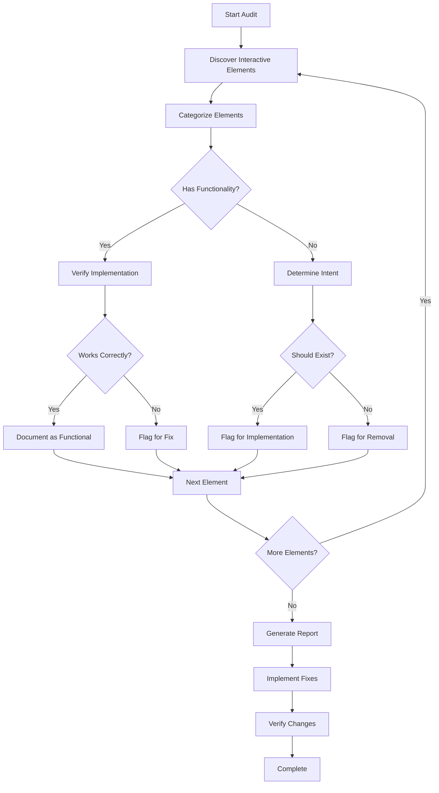

# Design Document

## Overview

This design outlines a systematic approach to auditing all interactive UI elements across the LexoHub application. The audit will be conducted page-by-page and component-by-component to ensure comprehensive coverage. The process involves discovery, analysis, categorization, and remediation of all buttons, tabs, links, and other interactive elements.

The audit will follow a phased approach, starting with high-traffic pages (Dashboard, Matters, Invoices) and progressing through the entire application systematically.

## Architecture

### Audit Process Flow



### Audit Scope Organization

The audit will be organized into the following categories:

1. **Pages** - All page-level components
2. **Navigation** - Navigation bars, menus, breadcrumbs
3. **Modals** - All modal dialogs and their triggers
4. **Forms** - Form submissions, resets, and actions
5. **Tables** - Row actions, bulk actions, pagination
6. **Cards** - Card-level actions and interactions
7. **Tabs** - Tab systems and their content
8. **Buttons** - Standalone buttons and button groups

## Components and Interfaces

### Audit Data Structure

```typescript
interface InteractiveElement {
  id: string;
  type: 'button' | 'tab' | 'link' | 'form-action' | 'modal-trigger' | 'other';
  location: {
    file: string;
    component: string;
    lineNumber: number;
  };
  label: string;
  handler?: string;
  status: 'functional' | 'needs-implementation' | 'needs-fix' | 'should-remove';
  priority: 'critical' | 'high' | 'medium' | 'low';
  notes: string;
  relatedElements?: string[];
}

interface AuditReport {
  totalElements: number;
  byStatus: Record<string, number>;
  byType: Record<string, number>;
  byPriority: Record<string, number>;
  elements: InteractiveElement[];
  recommendations: string[];
}

interface PageAudit {
  pageName: string;
  filePath: string;
  elements: InteractiveElement[];
  summary: {
    total: number;
    functional: number;
    needsWork: number;
    shouldRemove: number;
  };
}
```

### Audit Phases

#### Phase 1: Discovery and Cataloging

**Objective:** Identify all interactive elements across the application

**Approach:**
- Systematically review each page component
- Search for common patterns: `onClick`, `onSubmit`, `href`, `to`, `<button>`, `<a>`, `<Link>`
- Document each element with its location and apparent purpose
- Create initial categorization

**Pages to Audit:**
1. Dashboard Pages (DashboardPage, EnhancedDashboardPage)
2. Matters Pages (MattersPage, MatterWorkbenchPage, NewMatterWizardPage)
3. Invoices Pages (InvoicesPage)
4. Pro Forma Pages (ProFormaRequestPage, ProFormaRequestsPage)
5. Firms Pages (FirmsPage)
6. WIP Tracker (WIPTrackerPage)
7. Reports (ReportsPage)
8. Settings (SettingsPage)
9. Notifications (NotificationsPage)
10. Disputes & Credit Notes (DisputesPage, CreditNotesPage)
11. Audit Trail (AuditTrailPage)
12. Attorney Portal Pages
13. Partner Portal Pages
14. Authentication (LoginPage)
15. Subscription (SubscriptionPage, SubscriptionCallbackPage)
16. Profile (ProfilePage)
17. Cloud Storage (CloudStorageCallbackPage)

#### Phase 2: Functionality Verification

**Objective:** Verify each element has proper implementation

**Verification Checklist:**
- Does the element have an event handler?
- Does the handler call a valid function/service?
- Does the handler include error handling?
- Does the handler include loading states?
- Does the handler provide user feedback (toast, modal, navigation)?
- Is the element accessible (keyboard, ARIA)?
- Is the element disabled when appropriate?

**Testing Approach:**
- Code review of handler implementation
- Check for service layer integration
- Verify state management
- Check for edge case handling

#### Phase 3: Tab System Audit

**Objective:** Ensure all tab systems are complete and functional

**Tab Systems to Audit:**
1. Invoices Page tabs (invoices, proforma, time-entries, tracking)
2. Firms Page tabs (active, archived)
3. Settings Page tabs (profile, team, rate-cards, pdf-templates, etc.)
4. Matter Workbench tabs (overview, documents, time-entries, expenses, etc.)
5. Dashboard tabs (if any)
6. Reports tabs (if any)

**Tab Verification:**
- Each tab has corresponding content component
- Tab switching updates state correctly
- Active tab is visually indicated
- Tab content loads properly
- Empty states are handled
- Tab navigation is keyboard accessible

#### Phase 4: Modal and Dialog Audit

**Objective:** Verify all modal triggers and modal actions work correctly

**Modal Categories:**
1. Matter Modals (Create, Edit, Detail, Accept Brief, Quick Add)
2. Invoice Modals (Details, Record Payment, Credit Note)
3. Pro Forma Modals (Review, Simple)
4. Work Item Modals (Time Entry, Disbursement, Service)
5. Firm Modals (Add Attorney, Invite Attorney)
6. Settings Modals (various configuration modals)
7. Confirmation Dialogs

**Modal Verification:**
- Trigger buttons open correct modal
- Modal state management works
- Submit actions process correctly
- Cancel/close actions work
- Form validation is implemented
- Error handling is present
- Loading states are shown
- Success feedback is provided

#### Phase 5: Navigation Audit

**Objective:** Ensure all navigation elements lead to valid destinations

**Navigation Elements:**
1. Main Navigation Bar
2. Attorney Navigation Bar
3. Quick Actions Menu
4. Breadcrumbs
5. In-page navigation links
6. Card click navigation
7. Table row navigation

**Navigation Verification:**
- Links point to valid routes
- Navigation respects permissions
- Back buttons work correctly
- Breadcrumbs are accurate
- Deep linking works
- Navigation state is preserved

#### Phase 6: Form Action Audit

**Objective:** Verify all form submissions and actions work correctly

**Form Categories:**
1. Authentication forms (login, signup, password reset)
2. Matter creation/edit forms
3. Invoice forms
4. Pro forma forms
5. Time entry forms
6. Expense/disbursement forms
7. Settings forms
8. Search/filter forms

**Form Verification:**
- Submit buttons trigger submission
- Validation is implemented
- Error messages are clear
- Success feedback is provided
- Reset/cancel buttons work
- Form state is managed
- Unsaved changes are handled

## Data Models

### Audit Tracking

The audit will maintain a structured record of findings:

```typescript
// Audit findings will be stored in markdown format
// with the following structure:

interface AuditFindings {
  metadata: {
    auditDate: string;
    auditor: string;
    version: string;
  };
  summary: {
    totalElements: number;
    functional: number;
    needsImplementation: number;
    needsFix: number;
    shouldRemove: number;
  };
  pageAudits: PageAudit[];
  prioritizedIssues: InteractiveElement[];
  recommendations: string[];
}
```

### Priority Classification

**Critical Priority:**
- Broken core functionality (matter creation, invoice generation)
- Security-related actions (authentication, authorization)
- Payment/financial actions
- Data loss prevention (save, submit)

**High Priority:**
- Primary user workflows (matter management, time tracking)
- Navigation to key features
- Form submissions
- Modal triggers for important actions

**Medium Priority:**
- Secondary features (reports, exports)
- Bulk actions
- Filter/search functionality
- Settings and configuration

**Low Priority:**
- Cosmetic improvements
- Nice-to-have features
- Rarely used functionality
- Deprecated features pending removal

## Error Handling

### Audit Process Error Handling

1. **Missing Handler Detection:**
   - Flag elements with no onClick/onSubmit/href
   - Categorize as intentional (styling) or missing implementation

2. **Broken Reference Detection:**
   - Identify handlers calling non-existent functions
   - Check for undefined service methods
   - Verify import statements

3. **Incomplete Implementation Detection:**
   - Check for TODO comments
   - Identify console.log placeholders
   - Find empty function bodies

4. **Deprecated Code Detection:**
   - Identify `.deprecated.tsx` files
   - Find commented-out handlers
   - Locate unused imports

### Remediation Error Handling

1. **Safe Removal:**
   - Check for references before removing
   - Update imports after removal
   - Verify no broken dependencies

2. **Implementation Safety:**
   - Follow existing patterns
   - Include proper error handling
   - Add loading states
   - Provide user feedback

3. **Testing After Changes:**
   - Run TypeScript compiler
   - Check for console errors
   - Verify no broken imports
   - Test affected functionality

## Testing Strategy

### Audit Verification

1. **Automated Checks:**
   - Search for common patterns (onClick, onSubmit, etc.)
   - Identify elements without handlers
   - Find TODO/FIXME comments
   - Detect deprecated files

2. **Manual Review:**
   - Page-by-page visual inspection
   - Click through each interactive element
   - Test tab switching
   - Verify modal triggers
   - Test form submissions

3. **Code Review:**
   - Review handler implementations
   - Check service layer integration
   - Verify error handling
   - Confirm loading states

### Post-Remediation Testing

1. **Compilation Check:**
   - Run `npm run build` to verify no TypeScript errors
   - Check for unused imports
   - Verify no broken references

2. **Functional Testing:**
   - Test each modified element
   - Verify expected behavior
   - Check error scenarios
   - Test edge cases

3. **Regression Testing:**
   - Verify existing functionality still works
   - Check related features
   - Test navigation flows
   - Verify data integrity

4. **Accessibility Testing:**
   - Keyboard navigation
   - Screen reader compatibility
   - Focus management
   - ARIA labels

## Implementation Approach

### Audit Execution

1. **Create Audit Document:**
   - Initialize findings document
   - Set up tracking structure
   - Define categories

2. **Systematic Review:**
   - Process one page at a time
   - Document all findings
   - Categorize each element
   - Assign priorities

3. **Generate Report:**
   - Summarize findings
   - Create prioritized list
   - Provide recommendations
   - Estimate effort

### Remediation Execution

1. **Prioritize Issues:**
   - Start with critical items
   - Group related fixes
   - Plan implementation order

2. **Implement Fixes:**
   - Remove non-functional elements
   - Implement missing handlers
   - Fix broken implementations
   - Update documentation

3. **Verify Changes:**
   - Test each fix
   - Run diagnostics
   - Check for regressions
   - Update audit document

4. **Final Review:**
   - Comprehensive testing
   - Documentation update
   - Create summary report
   - Provide maintenance recommendations

## Maintenance and Monitoring

### Ongoing Practices

1. **Code Review Standards:**
   - Require handlers for all interactive elements
   - Enforce error handling
   - Mandate loading states
   - Require user feedback

2. **Component Guidelines:**
   - Use AsyncButton for async actions
   - Implement proper modal patterns
   - Follow form validation standards
   - Use consistent navigation patterns

3. **Documentation:**
   - Document component interactions
   - Maintain handler documentation
   - Update audit findings
   - Track technical debt

4. **Periodic Re-audits:**
   - Quarterly UI audits
   - Review new features
   - Check for regressions
   - Update standards

## Deliverables

1. **Comprehensive Audit Report:**
   - Complete inventory of interactive elements
   - Categorized findings
   - Prioritized issues
   - Recommendations

2. **Remediation Plan:**
   - Prioritized fix list
   - Implementation estimates
   - Risk assessment
   - Testing plan

3. **Implementation Summary:**
   - Changes made
   - Elements removed
   - Logic implemented
   - Tests performed

4. **Maintenance Guidelines:**
   - Best practices
   - Code standards
   - Review checklist
   - Future audit schedule
