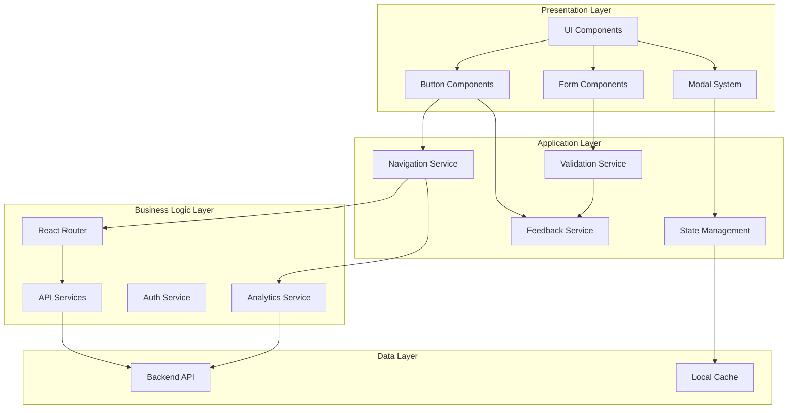
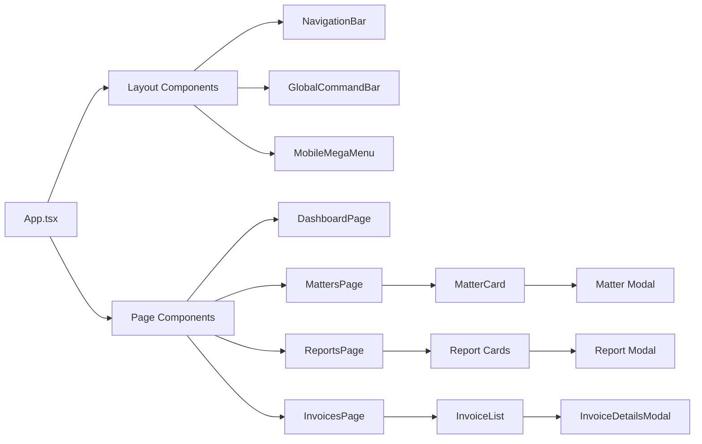
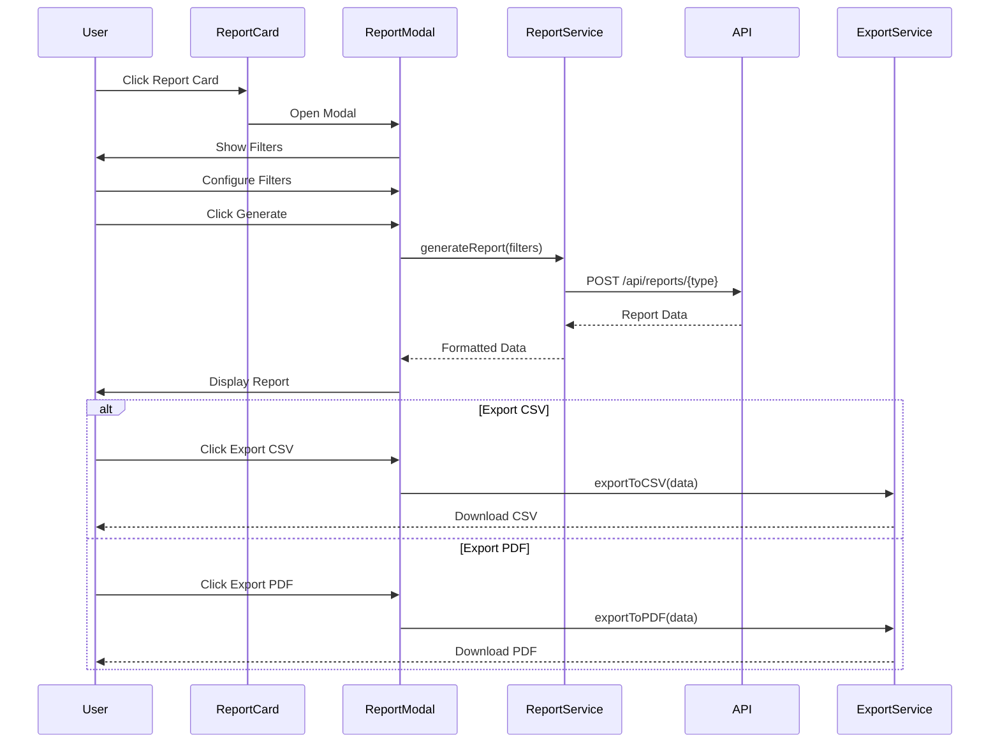

# Design Document

## Overview

This design document outlines the comprehensive UI/UX enhancement strategy for LexoHub, focusing on ensuring every button and interactive element performs its intended function with proper visual feedback, routing, and user experience. The design establishes a systematic approach to audit, categorize, and implement button interactions across the entire application while maintaining strict adherence to the Mpondo Gold and Judicial Blue theme with metallic gray accents.

The solution architecture consists of:
1. **Button Interaction System** - Centralized button component library with consistent behavior patterns
2. **Navigation Router Enhancement** - Improved routing with state management and feedback
3. **Modal Management System** - Unified modal handling with proper lifecycle management
4. **Form State Management** - Comprehensive form validation and submission handling
5. **Feedback & Notification System** - Toast notifications, loading states, and error handling
6. **Analytics Integration** - User interaction tracking for continuous improvement

## Architecture

### High-Level System Architecture



### Component Hierarchy



## Components and Interfaces

### 1. Button Component System

#### Base Button Component Interface

```typescript
interface ButtonProps {
  variant: 'primary' | 'secondary' | 'ghost' | 'danger' | 'success';
  size: 'sm' | 'md' | 'lg';
  loading?: boolean;
  disabled?: boolean;
  icon?: React.ReactNode;
  iconPosition?: 'left' | 'right';
  fullWidth?: boolean;
  onClick?: (e: React.MouseEvent) => void | Promise<void>;
  type?: 'button' | 'submit' | 'reset';
  ariaLabel?: string;
  ariaExpanded?: boolean;
  ariaHasPopup?: boolean;
  className?: string;
  children: React.ReactNode;
}

interface AsyncButtonProps extends ButtonProps {
  onAsyncClick: () => Promise<void>;
  successMessage?: string;
  errorMessage?: string;
}
```

#### Button Variants and Theme Mapping

```typescript
const buttonVariants = {
  primary: {
    base: 'bg-judicial-blue text-white hover:bg-judicial-blue-dark',
    disabled: 'bg-gray-300 text-gray-500 cursor-not-allowed',
    loading: 'bg-judicial-blue-dark cursor-wait'
  },
  secondary: {
    base: 'bg-mpondo-gold text-judicial-blue hover:bg-mpondo-gold-dark',
    disabled: 'bg-gray-200 text-gray-400 cursor-not-allowed',
    loading: 'bg-mpondo-gold-dark cursor-wait'
  },
  ghost: {
    base: 'bg-transparent text-judicial-blue border border-judicial-blue hover:bg-judicial-blue hover:text-white',
    disabled: 'bg-transparent text-gray-400 border-gray-300 cursor-not-allowed',
    loading: 'bg-judicial-blue-light cursor-wait'
  },
  danger: {
    base: 'bg-red-600 text-white hover:bg-red-700',
    disabled: 'bg-red-200 text-red-400 cursor-not-allowed',
    loading: 'bg-red-700 cursor-wait'
  },
  success: {
    base: 'bg-green-600 text-white hover:bg-green-700',
    disabled: 'bg-green-200 text-green-400 cursor-not-allowed',
    loading: 'bg-green-700 cursor-wait'
  }
};
```

### 2. Navigation System

#### Navigation Service Interface

```typescript
interface NavigationService {
  navigateTo(path: string, options?: NavigationOptions): void;
  goBack(): void;
  goForward(): void;
  getCurrentPath(): string;
  updateActiveState(path: string): void;
  scrollToTop(): void;
  trackNavigation(from: string, to: string): void;
}

interface NavigationOptions {
  replace?: boolean;
  state?: any;
  scrollToTop?: boolean;
  trackAnalytics?: boolean;
}

interface NavigationItem {
  id: string;
  label: string;
  path: string;
  icon: React.ReactNode;
  badge?: number;
  requiredPermission?: string;
  children?: NavigationItem[];
}
```

#### Navigation Implementation Strategy

The navigation system will use React Router v6 with enhanced state management:

1. **Active State Management**: Track current route and update navigation indicators
2. **Breadcrumb Generation**: Automatically generate breadcrumbs based on route hierarchy
3. **Permission-Based Rendering**: Show/hide navigation items based on user permissions
4. **Mobile Optimization**: Responsive navigation with mobile menu and gesture support

### 3. Modal Management System

#### Modal Manager Interface

```typescript
interface ModalManager {
  openModal(modalId: string, props?: any): void;
  closeModal(modalId: string): void;
  closeAllModals(): void;
  isModalOpen(modalId: string): boolean;
  getModalProps(modalId: string): any;
}

interface ModalProps {
  id: string;
  title: string;
  size: 'sm' | 'md' | 'lg' | 'xl' | 'full';
  closeOnOverlayClick?: boolean;
  closeOnEscape?: boolean;
  showCloseButton?: boolean;
  onClose?: () => void;
  onOpen?: () => void;
  footer?: React.ReactNode;
  children: React.ReactNode;
}

interface ConfirmationModalProps extends ModalProps {
  message: string;
  confirmText?: string;
  cancelText?: string;
  variant?: 'info' | 'warning' | 'danger';
  onConfirm: () => void | Promise<void>;
  onCancel?: () => void;
}
```

#### Modal State Management

```typescript
interface ModalState {
  modals: Map<string, {
    isOpen: boolean;
    props: any;
    zIndex: number;
  }>;
  modalStack: string[];
}

// Modal actions
type ModalAction =
  | { type: 'OPEN_MODAL'; payload: { id: string; props: any } }
  | { type: 'CLOSE_MODAL'; payload: { id: string } }
  | { type: 'CLOSE_ALL_MODALS' };
```

### 4. Form State Management

#### Form Handler Interface

```typescript
interface FormHandler<T> {
  values: T;
  errors: Partial<Record<keyof T, string>>;
  touched: Partial<Record<keyof T, boolean>>;
  isSubmitting: boolean;
  isValid: boolean;
  isDirty: boolean;
  
  handleChange(field: keyof T, value: any): void;
  handleBlur(field: keyof T): void;
  handleSubmit(e: React.FormEvent): Promise<void>;
  setFieldValue(field: keyof T, value: any): void;
  setFieldError(field: keyof T, error: string): void;
  resetForm(): void;
  validateField(field: keyof T): boolean;
  validateForm(): boolean;
}

interface FormConfig<T> {
  initialValues: T;
  validationSchema: ValidationSchema<T>;
  onSubmit: (values: T) => Promise<void>;
  onSuccess?: (result: any) => void;
  onError?: (error: Error) => void;
}

interface ValidationSchema<T> {
  [K in keyof T]?: ValidationRule[];
}

interface ValidationRule {
  type: 'required' | 'email' | 'min' | 'max' | 'pattern' | 'custom';
  value?: any;
  message: string;
  validator?: (value: any) => boolean;
}
```

### 5. Feedback & Notification System

#### Toast Notification Interface

```typescript
interface ToastNotification {
  id: string;
  type: 'success' | 'error' | 'warning' | 'info';
  title: string;
  message?: string;
  duration?: number;
  action?: {
    label: string;
    onClick: () => void;
  };
  dismissible?: boolean;
}

interface ToastService {
  success(title: string, message?: string, options?: ToastOptions): void;
  error(title: string, message?: string, options?: ToastOptions): void;
  warning(title: string, message?: string, options?: ToastOptions): void;
  info(title: string, message?: string, options?: ToastOptions): void;
  dismiss(id: string): void;
  dismissAll(): void;
}

interface ToastOptions {
  duration?: number;
  action?: { label: string; onClick: () => void };
  position?: 'top-right' | 'top-center' | 'bottom-right' | 'bottom-center';
}
```

#### Loading State Management

```typescript
interface LoadingState {
  isLoading: boolean;
  loadingMessage?: string;
  progress?: number;
}

interface LoadingService {
  startLoading(key: string, message?: string): void;
  updateProgress(key: string, progress: number): void;
  stopLoading(key: string): void;
  isLoading(key: string): boolean;
}
```

### 6. Reports Page Button Implementation

#### Report Card Component

```typescript
interface ReportCard {
  id: string;
  title: string;
  description: string;
  icon: React.ReactNode;
  category: 'financial' | 'operational' | 'client' | 'custom';
  requiredTier?: 'free' | 'professional' | 'enterprise';
  onClick: () => void;
}

interface ReportModalProps {
  reportType: string;
  title: string;
  filters: ReportFilter[];
  onGenerate: (filters: FilterValues) => Promise<ReportData>;
  onExportCSV: (data: ReportData) => void;
  onExportPDF: (data: ReportData) => void;
}

interface ReportFilter {
  id: string;
  label: string;
  type: 'date-range' | 'select' | 'multi-select' | 'text';
  options?: { label: string; value: string }[];
  required?: boolean;
  defaultValue?: any;
}

interface ReportData {
  headers: string[];
  rows: any[][];
  summary?: Record<string, any>;
  chartData?: ChartData[];
}
```

#### Report Generation Flow



## Data Models

### Button Interaction Event Model

```typescript
interface ButtonInteractionEvent {
  eventId: string;
  timestamp: Date;
  userId: string;
  sessionId: string;
  buttonId: string;
  buttonType: string;
  buttonLabel: string;
  pageContext: string;
  action: 'click' | 'submit' | 'cancel';
  outcome: 'success' | 'error' | 'cancelled';
  errorMessage?: string;
  duration?: number;
}
```

### Navigation Event Model

```typescript
interface NavigationEvent {
  eventId: string;
  timestamp: Date;
  userId: string;
  sessionId: string;
  fromPath: string;
  toPath: string;
  navigationMethod: 'click' | 'browser-back' | 'browser-forward' | 'direct';
  duration: number;
}
```

### Form Submission Event Model

```typescript
interface FormSubmissionEvent {
  eventId: string;
  timestamp: Date;
  userId: string;
  formId: string;
  formType: string;
  fields: string[];
  validationErrors?: string[];
  submissionDuration: number;
  outcome: 'success' | 'validation-error' | 'server-error';
  errorMessage?: string;
}
```

## Error Handling

### Error Classification

```typescript
enum ErrorType {
  NETWORK_ERROR = 'NETWORK_ERROR',
  VALIDATION_ERROR = 'VALIDATION_ERROR',
  PERMISSION_ERROR = 'PERMISSION_ERROR',
  NOT_FOUND_ERROR = 'NOT_FOUND_ERROR',
  SERVER_ERROR = 'SERVER_ERROR',
  UNKNOWN_ERROR = 'UNKNOWN_ERROR'
}

interface AppError {
  type: ErrorType;
  message: string;
  details?: any;
  recoverable: boolean;
  retryable: boolean;
  userMessage: string;
  technicalMessage?: string;
}
```

### Error Handling Strategy

```typescript
interface ErrorHandler {
  handleError(error: Error, context: ErrorContext): void;
  getErrorMessage(error: AppError): string;
  shouldRetry(error: AppError): boolean;
  logError(error: AppError, context: ErrorContext): void;
}

interface ErrorContext {
  component: string;
  action: string;
  userId?: string;
  additionalData?: any;
}

// Error recovery strategies
const errorRecoveryStrategies = {
  [ErrorType.NETWORK_ERROR]: {
    userMessage: 'Connection lost. Please check your internet and try again.',
    showRetry: true,
    autoRetry: true,
    maxRetries: 3
  },
  [ErrorType.VALIDATION_ERROR]: {
    userMessage: 'Please correct the highlighted fields.',
    showRetry: false,
    autoRetry: false
  },
  [ErrorType.PERMISSION_ERROR]: {
    userMessage: 'You don\'t have permission to perform this action.',
    showRetry: false,
    autoRetry: false,
    suggestUpgrade: true
  },
  [ErrorType.SERVER_ERROR]: {
    userMessage: 'Something went wrong on our end. Please try again later.',
    showRetry: true,
    autoRetry: false,
    contactSupport: true
  }
};
```

### Error Boundary Implementation

```typescript
interface ErrorBoundaryProps {
  fallback?: React.ReactNode;
  onError?: (error: Error, errorInfo: React.ErrorInfo) => void;
  children: React.ReactNode;
}

interface ErrorBoundaryState {
  hasError: boolean;
  error?: Error;
}
```

## Testing Strategy

### Unit Testing

**Button Components**
- Test all button variants render correctly
- Test loading states display spinner and disable interaction
- Test disabled states prevent clicks
- Test async button handlers with success/error scenarios
- Test accessibility attributes (aria-label, aria-expanded, etc.)
- Test keyboard navigation (Enter, Space)

**Navigation Service**
- Test route navigation updates URL and active state
- Test browser back/forward button handling
- Test scroll-to-top on navigation
- Test analytics tracking on navigation
- Test permission-based route access

**Modal Manager**
- Test modal open/close functionality
- Test modal stacking (multiple modals)
- Test focus trap within modal
- Test Escape key closes modal
- Test overlay click closes modal (when enabled)
- Test body scroll lock when modal is open

**Form Handler**
- Test form validation on field blur
- Test form validation on submit
- Test error message display
- Test form reset functionality
- Test dirty state tracking
- Test async submission with loading states

### Integration Testing

**Report Generation Flow**
- Test clicking report card opens modal
- Test filter configuration
- Test report generation with valid filters
- Test CSV export downloads file
- Test PDF export downloads file
- Test error handling when generation fails

**Matter Creation Flow**
- Test opening matter creation modal
- Test multi-step form navigation
- Test form validation across steps
- Test successful matter creation
- Test navigation to new matter after creation

**Invoice Management Flow**
- Test invoice list filtering
- Test invoice card click opens details modal
- Test payment tracking updates
- Test invoice status changes
- Test bulk actions on multiple invoices

### End-to-End Testing

**Complete User Journeys**
1. Login → Dashboard → Create Matter → View Matter
2. Dashboard → Reports → Generate WIP Report → Export PDF
3. Matters → Filter by Status → Open Matter → Create Invoice
4. Invoices → Filter Outstanding → Open Invoice → Record Payment
5. Settings → Update Profile → Change Password → Logout

### Accessibility Testing

- Keyboard navigation through all interactive elements
- Screen reader compatibility (NVDA, JAWS)
- Color contrast ratios meet WCAG AA standards
- Focus indicators visible on all interactive elements
- Form labels properly associated with inputs
- Error messages announced to screen readers
- Modal dialogs properly announced and managed

### Performance Testing

- Button click response time < 100ms
- Navigation transition < 200ms
- Modal open animation < 300ms
- Form validation < 50ms
- Report generation < 3s for standard reports
- Page load time < 2s
- Time to interactive < 3s

## Implementation Phases

### Phase 1: Foundation (Core Infrastructure)
- Create base Button component with all variants
- Implement NavigationService with routing
- Create ModalManager with state management
- Implement FormHandler with validation
- Create ToastService for notifications
- Set up error handling infrastructure

### Phase 2: Navigation & Routing
- Enhance NavigationBar with active states
- Implement GlobalCommandBar search functionality
- Create MobileMegaMenu with touch gestures
- Add breadcrumb navigation
- Implement browser back/forward handling
- Add navigation analytics tracking

### Phase 3: Reports Page Implementation
- Create ReportCard components for all report types
- Implement ReportModal with filters
- Create report generation service
- Implement CSV export functionality
- Implement PDF export functionality
- Add report data visualization (charts)

### Phase 4: Forms & Modals
- Implement matter creation modal
- Create pro forma request modal
- Implement invoice details modal
- Add confirmation dialogs for destructive actions
- Create form validation feedback
- Implement unsaved changes warning

### Phase 5: Actions & Feedback
- Implement quick action buttons
- Add bulk action functionality
- Create loading states for all async actions
- Implement success/error toast notifications
- Add progress indicators for long operations
- Create retry mechanisms for failed actions

### Phase 6: Accessibility & Polish
- Add keyboard navigation support
- Implement focus management
- Add ARIA attributes throughout
- Test with screen readers
- Ensure color contrast compliance
- Add touch target sizing for mobile

### Phase 7: Analytics & Monitoring
- Implement button interaction tracking
- Add navigation flow tracking
- Track form submission metrics
- Monitor error rates and types
- Create analytics dashboard
- Set up alerting for critical errors

## Design Decisions and Rationales

### 1. Centralized Button Component
**Decision**: Create a single, flexible Button component rather than multiple specialized components.

**Rationale**: 
- Ensures visual consistency across the application
- Simplifies maintenance and updates
- Reduces code duplication
- Makes theme changes easier to implement
- Provides a single source of truth for button behavior

### 2. Context-Based Modal Management
**Decision**: Use React Context for modal state management rather than prop drilling.

**Rationale**:
- Allows any component to open/close modals without prop drilling
- Centralizes modal state for easier debugging
- Enables modal stacking and z-index management
- Simplifies modal lifecycle management
- Reduces component coupling

### 3. Async Button Pattern
**Decision**: Create specialized async button handlers that manage loading states automatically.

**Rationale**:
- Prevents double-submission bugs
- Provides consistent loading feedback
- Simplifies error handling
- Reduces boilerplate in components
- Improves user experience with immediate feedback

### 4. Toast Notifications Over Alerts
**Decision**: Use toast notifications instead of browser alerts for feedback.

**Rationale**:
- Non-blocking user experience
- Consistent with modern UI patterns
- Allows multiple notifications simultaneously
- Provides better visual design options
- Enables action buttons within notifications

### 5. Form Validation Strategy
**Decision**: Implement validation on blur and submit, not on every keystroke.

**Rationale**:
- Reduces user frustration from premature errors
- Improves performance by reducing validation calls
- Follows common UX best practices
- Still provides immediate feedback when needed
- Balances validation thoroughness with user experience

### 6. Progressive Enhancement for Reports
**Decision**: Load report data on-demand rather than pre-loading all reports.

**Rationale**:
- Improves initial page load performance
- Reduces unnecessary API calls
- Allows for dynamic filter options
- Enables real-time data in reports
- Scales better with large datasets

### 7. Mobile-First Responsive Design
**Decision**: Design button interactions for mobile first, then enhance for desktop.

**Rationale**:
- Ensures touch targets are appropriately sized
- Forces prioritization of essential actions
- Improves overall usability
- Aligns with modern web development practices
- Ensures accessibility on all devices

### 8. Optimistic UI Updates
**Decision**: Update UI immediately on user action, then sync with server.

**Rationale**:
- Provides instant feedback to users
- Improves perceived performance
- Reduces waiting time
- Handles rollback on errors
- Creates more responsive feel

## Security Considerations

### Button Action Authorization
- Verify user permissions before executing sensitive actions
- Implement server-side validation for all button actions
- Use CSRF tokens for state-changing operations
- Rate limit button actions to prevent abuse
- Log all sensitive button interactions for audit trails

### Modal Security
- Sanitize all user input in modal forms
- Validate data on both client and server
- Prevent XSS attacks in modal content
- Secure file uploads in modals
- Implement proper session management

### Navigation Security
- Validate route permissions on navigation
- Prevent unauthorized access to protected routes
- Implement proper authentication checks
- Secure deep linking with token validation
- Protect against open redirect vulnerabilities

## Performance Optimization

### Button Rendering
- Use React.memo for button components
- Implement debouncing for rapid clicks
- Lazy load icon libraries
- Optimize re-renders with proper key usage
- Use CSS transitions over JavaScript animations

### Modal Performance
- Lazy load modal content
- Unmount modals when closed (optional)
- Use portal for modal rendering
- Optimize modal animations
- Implement virtual scrolling for large modal content

### Form Performance
- Debounce validation calls
- Use controlled components efficiently
- Implement field-level validation caching
- Optimize re-renders with React.memo
- Use form libraries (React Hook Form) for complex forms

### Report Generation
- Implement pagination for large datasets
- Use web workers for data processing
- Cache report results when appropriate
- Implement progressive loading for charts
- Optimize CSV/PDF generation algorithms

## Monitoring and Analytics

### Key Metrics to Track
- Button click-through rates
- Navigation path analysis
- Form completion rates
- Error rates by type
- Average response times
- User engagement patterns
- Feature adoption rates
- Accessibility usage patterns

### Analytics Implementation
```typescript
interface AnalyticsEvent {
  category: 'button' | 'navigation' | 'form' | 'modal' | 'error';
  action: string;
  label: string;
  value?: number;
  metadata?: Record<string, any>;
}

interface AnalyticsService {
  trackEvent(event: AnalyticsEvent): void;
  trackPageView(path: string): void;
  trackTiming(category: string, variable: string, time: number): void;
  trackError(error: AppError, context: ErrorContext): void;
  setUserProperties(properties: Record<string, any>): void;
}
```

## Maintenance and Documentation

### Component Documentation
- Document all button variants with examples
- Provide usage guidelines for each component
- Include accessibility considerations
- Document common patterns and anti-patterns
- Maintain a living style guide

### Code Standards
- Use TypeScript for type safety
- Follow React best practices
- Implement consistent naming conventions
- Write self-documenting code
- Include JSDoc comments for complex logic

### Testing Requirements
- Maintain >80% code coverage
- Write tests before fixing bugs
- Include accessibility tests
- Test on multiple browsers
- Test on multiple devices

This design provides a comprehensive foundation for implementing consistent, accessible, and delightful button interactions throughout the LexoHub application while maintaining strict adherence to the application's theme and core values.