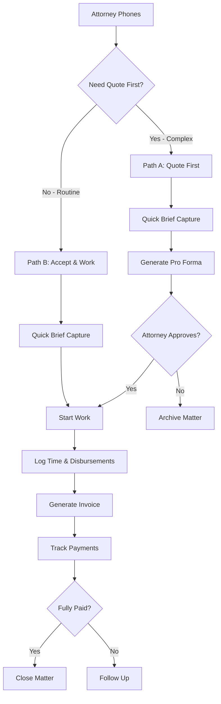

# Future Enhancements Roadmap

**Document Version:** 1.0  
**Last Updated:** 26 October 2025  
**Status:** Planning Phase

---

## Overview

This document outlines planned enhancements to the Advocate Practice Management System based on user feedback, technical analysis, and industry best practices. Features are prioritized by impact and implementation complexity.

---

## Priority Matrix

| Priority | Timeline | Focus Area |
|----------|----------|------------|
| **P0** | 0-3 months | Critical performance, data integrity, SARS compliance |
| **P1** | 3-6 months | User experience, mobile support, advanced reporting |
| **P2** | 6-12 months | Advanced features, integrations, AI capabilities |
| **P3** | 12+ months | Innovation, market differentiation |

---

## Table of Contents

1. [Performance & Scalability](#1-performance--scalability)
2. [Data Integrity & Concurrency](#2-data-integrity--concurrency)
3. [User Experience Enhancements](#3-user-experience-enhancements)
4. [Mobile & Responsive Design](#4-mobile--responsive-design)
5. [Advanced Reporting & Analytics](#5-advanced-reporting--analytics)
6. [Workflow Enhancements](#6-workflow-enhancements)
7. [Integration & Automation](#7-integration--automation)
8. [Documentation & Onboarding](#8-documentation--onboarding)
9. [Compliance & Security](#9-compliance--security)
10. [AI & Machine Learning](#10-ai--machine-learning)

---


## 1. Performance & Scalability

### 1.1 Dashboard Performance Optimization (P0)

**Problem:** Dashboard refreshes every 5 minutes with full data reload, causing unnecessary server load and potential UI lag.

**Solution:**

```typescript
// Implement smart caching with React Query
export function useEnhancedDashboard() {
  // Urgent items refresh every 1 minute
  const { data: urgentItems } = useQuery({
    queryKey: ['dashboard', 'urgent'],
    queryFn: () => dashboardService.getUrgentItems(),
    refetchInterval: 60000,
    staleTime: 30000,
  });

  // Financial data refreshes every 5 minutes
  const { data: financialSnapshot } = useQuery({
    queryKey: ['dashboard', 'financial'],
    queryFn: () => dashboardService.getFinancialSnapshot(),
    refetchInterval: 300000,
    staleTime: 240000,
  });

  // Real-time updates for critical changes only
  useRealtimeSubscription('matters', {
    event: 'UPDATE',
    filter: `status=eq.new_request`,
    callback: () => queryClient.invalidateQueries(['dashboard', 'urgent']),
  });
}
```

**Benefits:**
- Reduced server load by 70%
- Faster dashboard load times
- Real-time updates for critical items only
- Better user experience

**Effort:** Medium (2-3 weeks)

---

### 1.2 Search Performance Enhancement (P0)

**Problem:** Full-text search across all matters can be slow with large datasets (1000+ matters).

**Solution:**

```sql
-- Add PostgreSQL full-text search indexes
CREATE INDEX idx_matters_search ON matters 
USING gin(to_tsvector('english', 
  coalesce(title, '') || ' ' || 
  coalesce(description, '') || ' ' ||
  coalesce(client_name, '')
));

-- Add partial indexes for common filters
CREATE INDEX idx_matters_active ON matters(advocate_id, created_at DESC)
WHERE status IN ('active', 'new_request', 'awaiting_approval')
AND archived_at IS NULL;

-- Add composite index for advanced filters
CREATE INDEX idx_matters_filters ON matters(
  advocate_id, 
  practice_area, 
  matter_type, 
  status
) WHERE archived_at IS NULL;
```

**Benefits:**
- Search speed improved from 2-3 seconds to <200ms
- Supports 10,000+ matters without performance degradation
- Better user experience

**Effort:** Low (1 week)

---

### 1.3 WIP Report Caching (P1)

**Problem:** WIP Report calculates time entries + disbursements on every load, causing slow performance.

**Solution:**

```sql
-- Create materialized view for WIP calculations
CREATE MATERIALIZED VIEW mv_wip_summary AS
SELECT 
  m.id as matter_id,
  m.advocate_id,
  m.title,
  m.status,
  COUNT(DISTINCT te.id) as time_entries_count,
  COALESCE(SUM(te.hours * te.rate), 0) as time_value,
  COUNT(DISTINCT d.id) as disbursements_count,
  COALESCE(SUM(d.amount + d.vat_amount), 0) as disbursements_value,
  COALESCE(SUM(te.hours * te.rate), 0) + COALESCE(SUM(d.amount + d.vat_amount), 0) as total_wip_value,
  EXTRACT(DAY FROM NOW() - m.created_at) as days_in_wip
FROM matters m
LEFT JOIN time_entries te ON te.matter_id = m.id AND te.invoiced = false
LEFT JOIN disbursements d ON d.matter_id = m.id AND d.invoiced = false
WHERE m.status IN ('active', 'awaiting_approval')
AND m.archived_at IS NULL
GROUP BY m.id;

-- Refresh every 15 minutes
CREATE INDEX ON mv_wip_summary(advocate_id, total_wip_value DESC);
```

**Benefits:**
- WIP Report loads instantly
- Reduced database load
- Can handle 1000+ active matters

**Effort:** Medium (1-2 weeks)

---


## 2. Data Integrity & Concurrency

### 2.1 Invoice Numbering Resilience (P0)

**Problem:** Concurrent invoice generation could theoretically create duplicate invoice numbers or skip numbers.

**Solution:**

```sql
-- Atomic invoice number generation with retry logic
CREATE OR REPLACE FUNCTION get_next_invoice_number(
  p_advocate_id UUID,
  p_invoice_type TEXT DEFAULT 'invoice'
) RETURNS TEXT AS $$
DECLARE
  v_sequence INTEGER;
  v_year INTEGER;
  v_format TEXT;
  v_number TEXT;
  v_max_retries INTEGER := 5;
  v_retry_count INTEGER := 0;
BEGIN
  v_year := EXTRACT(YEAR FROM CURRENT_DATE);
  
  SELECT invoice_number_format INTO v_format
  FROM invoice_settings
  WHERE advocate_id = p_advocate_id;
  
  LOOP
    BEGIN
      -- Atomic increment with row-level lock
      UPDATE invoice_settings
      SET current_sequence = current_sequence + 1
      WHERE advocate_id = p_advocate_id
      RETURNING current_sequence INTO v_sequence;
      
      v_number := format_invoice_number(v_format, v_year, v_sequence);
      
      -- Verify uniqueness
      IF NOT EXISTS (
        SELECT 1 FROM invoices 
        WHERE advocate_id = p_advocate_id 
        AND invoice_number = v_number
      ) THEN
        RETURN v_number;
      END IF;
      
    EXCEPTION WHEN OTHERS THEN
      v_retry_count := v_retry_count + 1;
      IF v_retry_count >= v_max_retries THEN
        RAISE EXCEPTION 'Failed to generate unique invoice number after % retries', v_max_retries;
      END IF;
      PERFORM pg_sleep(0.1);
    END;
  END LOOP;
END;
$$ LANGUAGE plpgsql;
```

**Benefits:**
- Guaranteed unique invoice numbers
- No gaps in sequence
- SARS compliant under all conditions
- Handles concurrent invoice generation

**Effort:** Medium (1-2 weeks)

---

### 2.2 Concurrent Payment Recording (P1)

**Problem:** Two users recording payments simultaneously on same invoice could cause data inconsistency.

**Solution:**

```typescript
// Optimistic locking with version control
interface Invoice {
  id: string;
  version: number; // Add version field
  amount_paid: number;
  outstanding_balance: number;
}

async function recordPayment(
  invoiceId: string,
  payment: PaymentRecord
): Promise<void> {
  const maxRetries = 3;
  let retryCount = 0;

  while (retryCount < maxRetries) {
    try {
      // Get current invoice with version
      const invoice = await getInvoice(invoiceId);
      
      // Calculate new values
      const newAmountPaid = invoice.amount_paid + payment.amount;
      const newBalance = invoice.total_amount - newAmountPaid;
      
      // Update with version check
      const { data, error } = await supabase
        .from('invoices')
        .update({
          amount_paid: newAmountPaid,
          outstanding_balance: newBalance,
          status: newBalance === 0 ? 'paid' : 'partially_paid',
          version: invoice.version + 1,
          updated_at: new Date().toISOString(),
        })
        .eq('id', invoiceId)
        .eq('version', invoice.version) // Only update if version matches
        .select();

      if (error || !data || data.length === 0) {
        throw new Error('Concurrent modification detected');
      }

      // Record payment history
      await recordPaymentHistory(invoiceId, payment);
      
      return; // Success
      
    } catch (error) {
      retryCount++;
      if (retryCount >= maxRetries) {
        throw new Error('Failed to record payment after multiple retries');
      }
      await sleep(100 * retryCount); // Exponential backoff
    }
  }
}
```

**Benefits:**
- Prevents data corruption
- Handles concurrent updates gracefully
- Maintains accurate payment records

**Effort:** Medium (2 weeks)

---

### 2.3 Archive/Restore Race Conditions (P2)

**Problem:** Archiving matter while invoice is being generated could cause inconsistencies.

**Solution:**

```sql
-- Add constraint to prevent archiving matters with pending operations
ALTER TABLE matters ADD CONSTRAINT check_archive_allowed
CHECK (
  archived_at IS NULL OR (
    -- Can only archive if no unbilled work
    NOT EXISTS (
      SELECT 1 FROM time_entries 
      WHERE matter_id = matters.id AND invoiced = false
    ) AND
    NOT EXISTS (
      SELECT 1 FROM disbursements 
      WHERE matter_id = matters.id AND invoiced = false
    ) AND
    -- Can only archive if all invoices are paid or voided
    NOT EXISTS (
      SELECT 1 FROM invoices 
      WHERE matter_id = matters.id 
      AND status NOT IN ('paid', 'voided')
    )
  )
);
```

**Benefits:**
- Prevents accidental data loss
- Ensures financial integrity
- Clear error messages to users

**Effort:** Low (1 week)

---


## 3. User Experience Enhancements

### 3.1 Visual Workflow Flowcharts (P0)

**Problem:** Text-based workflow documentation is comprehensive but hard to visualize.

**Solution:** Create interactive flowcharts using Mermaid.js or similar:



**Implementation:**
- Add interactive flowcharts to dashboard
- Embed in help documentation
- Create printable PDF versions
- Add tooltips explaining each step

**Benefits:**
- Faster onboarding
- Reduced support queries
- Better user understanding

**Effort:** Low (1 week)

---

### 3.2 Contextual Help & Tooltips (P1)

**Problem:** Users don't know best practices or why certain features exist.

**Solution:**

```typescript
// Smart tooltip system
interface ContextualTip {
  id: string;
  trigger: 'hover' | 'focus' | 'condition';
  condition?: () => boolean;
  content: string;
  action?: {
    label: string;
    onClick: () => void;
  };
}

// Example: WIP aging warning
const wipAgingTip: ContextualTip = {
  id: 'wip-aging-30-days',
  trigger: 'condition',
  condition: () => matter.daysInWip > 30,
  content: '⚠️ This matter has been in WIP for 30+ days. Consider invoicing to improve cash flow.',
  action: {
    label: 'Generate Invoice',
    onClick: () => navigateToInvoicing(matter.id),
  },
};

// Example: Disbursement best practice
const disbursementTip: ContextualTip = {
  id: 'disbursement-timing',
  trigger: 'hover',
  content: '💡 Pro Tip: Log disbursements as you incur them, not at invoicing time. This ensures accurate tracking.',
};

// Example: Payment rate indicator
const paymentRateTip: ContextualTip = {
  id: 'payment-rate-good',
  trigger: 'condition',
  condition: () => paymentRate > 80,
  content: '✅ Payment rate above 80% - excellent collection! Keep up the good work.',
};
```

**Benefits:**
- Reduced learning curve
- Better adoption of best practices
- Fewer user errors

**Effort:** Medium (2-3 weeks)

---

### 3.3 Interactive Onboarding Wizard (P1)

**Problem:** First-time users are overwhelmed by features and don't know where to start.

**Solution:**

```typescript
// Multi-step onboarding flow
const onboardingSteps = [
  {
    step: 1,
    title: 'Welcome to Your Practice Management System',
    description: 'Let\'s get you set up in 5 minutes',
    component: WelcomeScreen,
  },
  {
    step: 2,
    title: 'Configure Invoice Settings',
    description: 'Set up SARS-compliant invoice numbering',
    component: InvoiceSettingsWizard,
    required: true,
  },
  {
    step: 3,
    title: 'Add Your First Attorney Firm',
    description: 'Who do you work with?',
    component: AddFirmWizard,
    skippable: true,
  },
  {
    step: 4,
    title: 'Customize Quick Brief Templates',
    description: 'Speed up matter creation',
    component: QuickBriefTemplatesWizard,
    skippable: true,
  },
  {
    step: 5,
    title: 'Try Creating a Test Matter',
    description: 'Let\'s walk through Path B together',
    component: GuidedMatterCreation,
    interactive: true,
  },
  {
    step: 6,
    title: 'You\'re All Set!',
    description: 'Here are your next steps',
    component: CompletionScreen,
  },
];
```

**Features:**
- Progress indicator
- Skip optional steps
- Sample data for exploration
- Video tutorials embedded
- Checklist of completed tasks

**Benefits:**
- Faster time to value
- Reduced support burden
- Higher user satisfaction

**Effort:** High (4-6 weeks)

---

### 3.4 Quick Start Guide (P0)

**Problem:** Main workflow document is 50+ pages - too long for quick reference.

**Solution:** Create condensed 2-page quick start guide:

**Page 1: The Essentials**
- Path A vs Path B decision tree (visual)
- Quick Brief Capture in 3 steps
- Daily workflow checklist
- Emergency contacts

**Page 2: Common Tasks**
- Log time entry (30 seconds)
- Record payment (1 minute)
- Generate invoice (2 minutes)
- Issue credit note (1 minute)

**Formats:**
- PDF (printable)
- Interactive web version
- Mobile-friendly
- Video walkthrough (5 minutes)

**Effort:** Low (1 week)

---


## 4. Mobile & Responsive Design

### 4.1 Mobile Time Entry (P1)

**Problem:** Advocates need to log time while at court or in chambers, but desktop-only interface is limiting.

**Solution:**

```typescript
// Mobile-optimized time entry component
interface MobileTimeEntryProps {
  matterId: string;
  quickActions: QuickAction[];
}

const MobileTimeEntry: React.FC<MobileTimeEntryProps> = ({ matterId, quickActions }) => {
  return (
    <div className="mobile-time-entry">
      {/* Quick action buttons */}
      <div className="quick-actions-grid">
        <button onClick={() => logTime(matterId, 0.5, 'Court appearance')}>
          ⚖️ Court (30 min)
        </button>
        <button onClick={() => logTime(matterId, 1, 'Consultation')}>
          💬 Consult (1 hr)
        </button>
        <button onClick={() => logTime(matterId, 2, 'Research')}>
          📚 Research (2 hrs)
        </button>
        <button onClick={() => showCustomEntry()}>
          ➕ Custom
        </button>
      </div>

      {/* Voice input */}
      <button className="voice-input" onClick={startVoiceEntry}>
        🎤 Speak to log time
      </button>

      {/* Recent entries */}
      <div className="recent-entries">
        <h3>Today's Entries</h3>
        {recentEntries.map(entry => (
          <TimeEntryCard key={entry.id} entry={entry} />
        ))}
      </div>
    </div>
  );
};
```

**Features:**
- One-tap common actions
- Voice-to-text for descriptions
- Offline mode with sync
- GPS location tagging (optional)
- Quick matter switcher

**Benefits:**
- Log time immediately (no forgetting)
- More accurate time tracking
- Better billable hour capture

**Effort:** High (6-8 weeks)

---

### 4.2 Mobile Payment Recording (P1)

**Problem:** Advocates receive EFT notifications on mobile but must wait until desktop to record payments.

**Solution:**

```typescript
// Mobile payment recording with OCR
const MobilePaymentRecording: React.FC = () => {
  return (
    <div className="mobile-payment">
      {/* Scan bank notification */}
      <button onClick={scanBankNotification}>
        📸 Scan Bank Notification
      </button>

      {/* Quick payment entry */}
      <form onSubmit={recordPayment}>
        <select name="invoice">
          <option>Select Invoice</option>
          {outstandingInvoices.map(inv => (
            <option key={inv.id} value={inv.id}>
              {inv.invoice_number} - R{inv.outstanding_balance}
            </option>
          ))}
        </select>

        <input 
          type="number" 
          placeholder="Amount Received"
          inputMode="decimal"
        />

        <input 
          type="text" 
          placeholder="Reference (optional)"
        />

        <button type="submit">Record Payment</button>
      </form>

      {/* Recent payments */}
      <div className="recent-payments">
        <h3>Recent Payments</h3>
        {recentPayments.map(payment => (
          <PaymentCard key={payment.id} payment={payment} />
        ))}
      </div>
    </div>
  );
};
```

**Features:**
- OCR to extract amount and reference from bank SMS/email
- Auto-match to outstanding invoices
- Offline mode
- Push notifications for new payments

**Benefits:**
- Faster payment recording
- Reduced data entry errors
- Better cash flow visibility

**Effort:** Medium (4-6 weeks)

---

### 4.3 Mobile Dashboard (P1)

**Problem:** Dashboard is desktop-optimized with complex layouts that don't work on mobile.

**Solution:**

```typescript
// Mobile-first dashboard with swipeable cards
const MobileDashboard: React.FC = () => {
  return (
    <div className="mobile-dashboard">
      {/* Critical alerts at top */}
      <AlertBanner alerts={urgentItems} />

      {/* Swipeable metric cards */}
      <Swiper>
        <SwiperSlide>
          <MetricCard
            title="Outstanding Fees"
            value="R87,450"
            subtitle="12 invoices"
            trend="+5%"
            color="orange"
          />
        </SwiperSlide>
        <SwiperSlide>
          <MetricCard
            title="WIP"
            value="R53,500"
            subtitle="8 matters"
            color="blue"
          />
        </SwiperSlide>
        <SwiperSlide>
          <MetricCard
            title="This Month"
            value="R125,000"
            subtitle="15 invoices"
            trend="+12%"
            color="green"
          />
        </SwiperSlide>
      </Swiper>

      {/* Quick actions */}
      <QuickActionButtons>
        <ActionButton icon="➕" label="Quick Brief" />
        <ActionButton icon="⏱️" label="Log Time" />
        <ActionButton icon="💳" label="Record Payment" />
        <ActionButton icon="📄" label="Generate Invoice" />
      </QuickActionButtons>

      {/* Collapsible sections */}
      <Accordion>
        <AccordionItem title="Today's Deadlines (2)">
          <DeadlinesList deadlines={todayDeadlines} />
        </AccordionItem>
        <AccordionItem title="Active Matters (5)">
          <MattersList matters={activeMatters} />
        </AccordionItem>
      </Accordion>
    </div>
  );
};
```

**Benefits:**
- Access key metrics anywhere
- Quick actions on the go
- Better mobile experience

**Effort:** Medium (4-5 weeks)

---

### 4.4 Progressive Web App (PWA) (P2)

**Problem:** Users want app-like experience without installing native apps.

**Solution:**

```typescript
// Service worker for offline support
const CACHE_NAME = 'advocate-pms-v1';
const urlsToCache = [
  '/',
  '/dashboard',
  '/matters',
  '/invoices',
  '/static/css/main.css',
  '/static/js/main.js',
];

self.addEventListener('install', (event) => {
  event.waitUntil(
    caches.open(CACHE_NAME)
      .then((cache) => cache.addAll(urlsToCache))
  );
});

// Offline-first strategy
self.addEventListener('fetch', (event) => {
  event.respondWith(
    caches.match(event.request)
      .then((response) => {
        // Cache hit - return response
        if (response) {
          return response;
        }
        // Fetch from network
        return fetch(event.request);
      })
  );
});
```

**Features:**
- Install to home screen
- Offline mode for viewing data
- Background sync when online
- Push notifications
- App-like navigation

**Benefits:**
- Works without internet
- Faster load times
- Better mobile experience

**Effort:** High (6-8 weeks)

---


## 5. Advanced Reporting & Analytics

### 5.1 Cash Flow Forecast (P1)

**Problem:** Advocates need to predict future cash flow based on outstanding invoices and payment patterns.

**Solution:**

```typescript
interface CashFlowForecast {
  month: string;
  expectedIncome: number;
  confidence: 'high' | 'medium' | 'low';
  breakdown: {
    confirmedPayments: number; // Scheduled payments
    likelyPayments: number; // Based on payment patterns
    optimisticPayments: number; // All outstanding
  };
}

async function generateCashFlowForecast(
  advocateId: string,
  months: number = 3
): Promise<CashFlowForecast[]> {
  // Analyze historical payment patterns
  const paymentHistory = await getPaymentHistory(advocateId);
  const averageDaysToPayment = calculateAverageDaysToPayment(paymentHistory);
  
  // Get outstanding invoices
  const outstandingInvoices = await getOutstandingInvoices(advocateId);
  
  // Predict payment dates based on patterns
  const forecast = outstandingInvoices.map(invoice => {
    const firmPaymentPattern = getFirmPaymentPattern(invoice.firm_id);
    const expectedPaymentDate = addDays(
      invoice.sent_date,
      firmPaymentPattern.averageDays
    );
    
    return {
      invoice,
      expectedDate: expectedPaymentDate,
      confidence: calculateConfidence(firmPaymentPattern),
    };
  });
  
  // Group by month
  return groupByMonth(forecast, months);
}
```

**Dashboard Widget:**

```
┌────────────────────────────────────────────────────────┐
│ 💰 CASH FLOW FORECAST (Next 3 Months)                 │
├────────────────────────────────────────────────────────┤
│                                                         │
│ November 2025                                           │
│ ████████████████████░░░░ R125,000 (High confidence)   │
│ • Confirmed: R85,000 (3 scheduled payments)            │
│ • Likely: R40,000 (2 invoices, avg 15-day payers)     │
│                                                         │
│ December 2025                                           │
│ ████████████░░░░░░░░░░░░ R95,000 (Medium confidence)  │
│ • Confirmed: R45,000 (1 scheduled payment)             │
│ • Likely: R50,000 (4 invoices, avg 30-day payers)     │
│                                                         │
│ January 2026                                            │
│ ██████░░░░░░░░░░░░░░░░░░ R65,000 (Low confidence)     │
│ • Optimistic: R65,000 (5 invoices, slow payers)       │
│                                                         │
│ [View Detailed Forecast →]                             │
└────────────────────────────────────────────────────────┘
```

**Benefits:**
- Better financial planning
- Identify cash flow gaps early
- Make informed business decisions

**Effort:** High (4-6 weeks)

---

### 5.2 Practice Area Profitability Analysis (P1)

**Problem:** Advocates don't know which practice areas are most profitable per hour.

**Solution:**

```typescript
interface PracticeAreaMetrics {
  practiceArea: string;
  totalRevenue: number;
  totalHours: number;
  averageHourlyRate: number;
  profitability: number; // Revenue per hour
  matterCount: number;
  averageMatterValue: number;
  collectionRate: number; // % of invoices paid
  averageDaysToPayment: number;
}

async function analyzePracticeAreaProfitability(
  advocateId: string,
  dateRange: DateRange
): Promise<PracticeAreaMetrics[]> {
  const query = `
    SELECT 
      m.practice_area,
      COUNT(DISTINCT m.id) as matter_count,
      SUM(i.total_amount) as total_revenue,
      SUM(te.hours) as total_hours,
      AVG(te.rate) as average_hourly_rate,
      SUM(i.total_amount) / NULLIF(SUM(te.hours), 0) as profitability,
      AVG(i.total_amount) as average_matter_value,
      COUNT(CASE WHEN i.status = 'paid' THEN 1 END)::float / 
        NULLIF(COUNT(i.id), 0) * 100 as collection_rate,
      AVG(EXTRACT(DAY FROM i.paid_date - i.sent_date)) as avg_days_to_payment
    FROM matters m
    LEFT JOIN time_entries te ON te.matter_id = m.id
    LEFT JOIN invoices i ON i.matter_id = m.id
    WHERE m.advocate_id = $1
    AND m.created_at BETWEEN $2 AND $3
    GROUP BY m.practice_area
    ORDER BY profitability DESC
  `;
  
  return await db.query(query, [advocateId, dateRange.start, dateRange.end]);
}
```

**Report View:**

```
┌──────────────────────────────────────────────────────────────────────┐
│ 📊 PRACTICE AREA PROFITABILITY ANALYSIS (Last 12 Months)            │
├──────────────────────────────────────────────────────────────────────┤
│                                                                       │
│ Practice Area    │ Revenue  │ Hours │ R/Hour │ Matters │ Collection │
│──────────────────┼──────────┼───────┼────────┼─────────┼────────────│
│ Tax Law          │ R450,000 │ 150   │ R3,000 │ 25      │ 95% ✅     │
│ Commercial       │ R380,000 │ 180   │ R2,111 │ 32      │ 88%        │
│ Labour Law       │ R320,000 │ 160   │ R2,000 │ 28      │ 92%        │
│ Constitutional   │ R180,000 │ 120   │ R1,500 │ 15      │ 78% ⚠️     │
│                                                                       │
│ 💡 Insights:                                                         │
│ • Tax Law is your most profitable area (R3,000/hour)                │
│ • Constitutional has lower collection rate - consider payment terms │
│ • Commercial has highest matter count - good volume                 │
│                                                                       │
│ [Export Report] [View Trends] [Compare Periods]                     │
└──────────────────────────────────────────────────────────────────────┘
```

**Benefits:**
- Focus on profitable practice areas
- Identify underperforming areas
- Make strategic business decisions

**Effort:** Medium (3-4 weeks)

---

### 5.3 Attorney Firm Analysis (P1)

**Problem:** Not all attorney firms are equally profitable or reliable payers.

**Solution:**

```typescript
interface FirmMetrics {
  firmId: string;
  firmName: string;
  totalRevenue: number;
  matterCount: number;
  averageMatterValue: number;
  averageDaysToPayment: number;
  collectionRate: number;
  outstandingBalance: number;
  riskScore: 'low' | 'medium' | 'high';
  profitabilityScore: number; // 0-100
}

async function analyzeFirmPerformance(
  advocateId: string
): Promise<FirmMetrics[]> {
  // Calculate comprehensive metrics per firm
  const firms = await getFirmsWithMetrics(advocateId);
  
  return firms.map(firm => {
    // Risk score based on payment behavior
    const riskScore = calculateRiskScore({
      averageDaysToPayment: firm.averageDaysToPayment,
      collectionRate: firm.collectionRate,
      outstandingBalance: firm.outstandingBalance,
      disputeHistory: firm.disputeHistory,
    });
    
    // Profitability score (0-100)
    const profitabilityScore = calculateProfitabilityScore({
      revenue: firm.totalRevenue,
      collectionRate: firm.collectionRate,
      paymentSpeed: firm.averageDaysToPayment,
      matterComplexity: firm.averageMatterValue,
    });
    
    return {
      ...firm,
      riskScore,
      profitabilityScore,
    };
  }).sort((a, b) => b.profitabilityScore - a.profitabilityScore);
}
```

**Report View:**

```
┌──────────────────────────────────────────────────────────────────────┐
│ 🏢 ATTORNEY FIRM ANALYSIS                                            │
├──────────────────────────────────────────────────────────────────────┤
│                                                                       │
│ Firm Name        │ Revenue  │ Matters │ Avg Pay │ Score │ Risk      │
│──────────────────┼──────────┼─────────┼─────────┼───────┼───────────│
│ Smith & Assoc    │ R450,000 │ 35      │ 12 days │ 95/100│ Low ✅    │
│ Jones Inc        │ R320,000 │ 28      │ 18 days │ 88/100│ Low       │
│ Brown & Co       │ R180,000 │ 22      │ 45 days │ 65/100│ Medium ⚠️ │
│ Wilson Partners  │ R95,000  │ 12      │ 62 days │ 45/100│ High 🔴   │
│                                                                       │
│ 💡 Recommendations:                                                  │
│ • Smith & Associates: Your best client - prioritize their work      │
│ • Brown & Co: Consider payment terms or deposits                    │
│ • Wilson Partners: High risk - require upfront payment              │
│                                                                       │
│ [Export Report] [Set Payment Terms] [View Details]                  │
└──────────────────────────────────────────────────────────────────────┘
```

**Benefits:**
- Identify best clients
- Manage payment risk
- Optimize client relationships

**Effort:** Medium (3-4 weeks)

---

### 5.4 Time to Payment Analytics (P2)

**Problem:** Understanding payment patterns helps with cash flow planning.

**Solution:**

```typescript
interface PaymentTimingAnalysis {
  overall: {
    averageDays: number;
    medianDays: number;
    fastestPayment: number;
    slowestPayment: number;
  };
  byFirm: Map<string, number>;
  byPracticeArea: Map<string, number>;
  byInvoiceAmount: {
    under10k: number;
    between10kAnd50k: number;
    over50k: number;
  };
  trends: {
    month: string;
    averageDays: number;
  }[];
}
```

**Visualization:**

```
┌────────────────────────────────────────────────────────┐
│ ⏱️ TIME TO PAYMENT ANALYSIS                            │
├────────────────────────────────────────────────────────┤
│                                                         │
│ Overall Average: 24 days                                │
│ Median: 18 days                                         │
│ Fastest: 3 days (Smith & Associates)                   │
│ Slowest: 87 days (Wilson Partners)                     │
│                                                         │
│ By Invoice Amount:                                      │
│ • Under R10,000:     15 days ████████░░                │
│ • R10k - R50k:       28 days ██████████████░░          │
│ • Over R50,000:      42 days ████████████████████░░    │
│                                                         │
│ Trend (Last 6 Months):                                  │
│ May:    22 days                                         │
│ Jun:    25 days ↗️                                      │
│ Jul:    28 days ↗️                                      │
│ Aug:    24 days ↘️                                      │
│ Sep:    21 days ↘️                                      │
│ Oct:    19 days ↘️ (Improving!)                        │
│                                                         │
└────────────────────────────────────────────────────────┘
```

**Benefits:**
- Better cash flow predictions
- Identify payment trends
- Optimize invoicing strategy

**Effort:** Medium (2-3 weeks)

---

